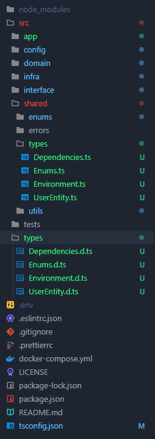
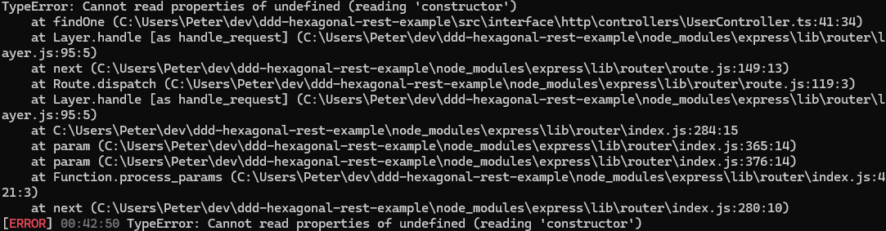

# Guias de desenvolvimento

## Erro de tipagens
Caso você tenha problemas com tipagem na hora de exportar elas do arquivo "types" encontrado na raíz do projeto, você deverá copiar a pasta "types" e colar ela dentro de shared e mudar todos os formatos dos arquivos para ".ts" ao invés de ".d.ts"

Vale mencionar que você precisará fazer algumas mudanças de import mas não é nada extremamente significativo

**Exemplo:** 

## Erro constructor undefined
Nos casos onde este erro ocorra, você pode tentar verificar se as funções onde utiliza-se a variável 'callName' estão construidas como funções normais de classes (Métodos), caso a resposta seja sim, você deverá mudar para arrow functions pois provavelmente o constructor só está ficando indefinido durante o processo da injeção.

**Exemplo do erro:**

